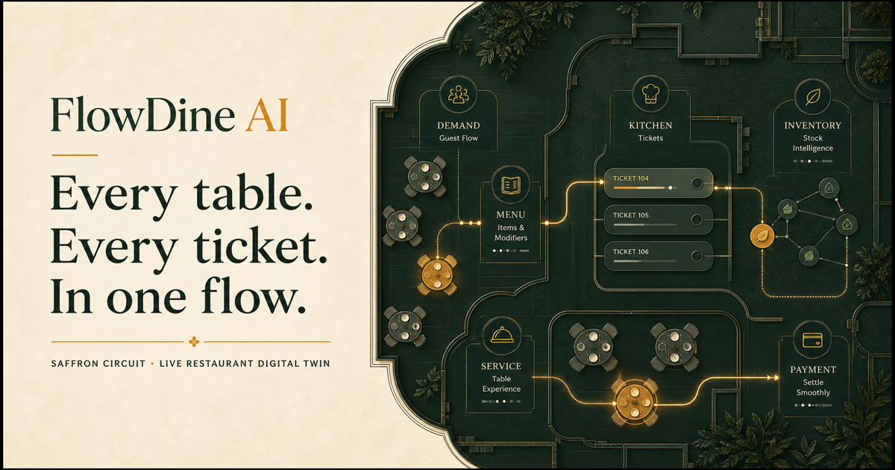

# FlowDine AI

> **Every table. Every ticket. In one flow.**

FlowDine AI is a live restaurant digital twin for the fictional flagship restaurant **Saffron Circuit**. It connects guest demand, recipe-aware menu availability, kitchen tickets, table service, inventory, queues, reservations, and manager intelligence in one shared operating state.

[**Open the live public demo →**](https://flowdine-ai.abhinavchaudhary484.chatgpt.site)



## Why it exists

Restaurants often run the dining room, kitchen, stock room, and guest journey in separate tools. That fragmentation creates unavailable-item orders, missed service requests, long waits, hidden bottlenecks, and reactive purchasing. FlowDine makes the restaurant observable and actionable as one system.

The central proof is an end-to-end order:

1. The menu calculates portions from the limiting recipe ingredient.
2. A guest places a dine-in order with notes and allergen context.
3. The server validates the role and available stock, reserves ingredients, records inventory movements, and creates a kitchen ticket.
4. Kitchen and waiter roles advance the same order state.
5. Manager metrics, forecasts, risks, and the copilot update from that state.

## Product surfaces

- **Guest:** live menu, search and filters, stock-aware availability, cart, preparation promise, reservations, queue, and service entry points.
- **Kitchen:** three-stage KDS, ticket age, lateness, allergens, notes, workload, and one-action transitions.
- **Waiter:** prioritized ready dishes and guest requests plus a live table map.
- **Manager:** revenue rhythm, digital twin metrics, stockout watch, explainable forecast, service flow, restocking, export, and an operations copilot.
- **AI workflow:** optional Gemini 3.6 Flash advisory answers via REST. With no key, the same UI returns deterministic evidence-based recommendations.

## Architecture


See [docs/ARCHITECTURE.md](docs/ARCHITECTURE.md) and [docs/DATABASE.md](docs/DATABASE.md) for the detailed flow and schema rationale.

## Stack

- Next.js 16 App Router, React 19, strict TypeScript
- Vinext/Vite deployment adapter for Cloudflare
- Cloudflare D1 for the hosted shared demo; optimistic versioned writes and audit events
- Drizzle schema/migrations for D1
- Supabase email/password and Google OAuth with cookie-backed SSR sessions
- PostgreSQL restaurant memberships for server-resolved staff authorization
- Supabase/PostgreSQL production migration with tenant IDs and initial RLS policies
- Gemini REST adapter with deterministic no-key fallback
- CSS design system with no component library dependency
- Node test runner, ESLint, and TypeScript compiler

## Seeded demo

The seed models one busy evening at Saffron Circuit:

- 18 recipe-linked dishes across five categories
- 18 ingredients with par levels and costs
- 16 dining tables
- active kitchen tickets, reservations, a queue, service requests, revenue history, hourly demand, and feedback

All prices are stored in paise and displayed in INR. Images are loaded from Unsplash and therefore require an internet connection; core workflows do not.

## Run locally

Requirements: Node.js 22.13+ and pnpm.

```bash
pnpm install
pnpm dev:local
```

Open `http://localhost:3000`. `dev:local` uses an in-memory development adapter and resets to seed data when the server restarts.

Cloudflare-local development uses `pnpm dev`, but Workerd requires macOS 13.5+ on macOS. The production deployment does not share that local OS limitation.

## Configuration

Copy `.env.example` to `.env.local` only if you want optional integrations:

```bash
cp .env.example .env.local
```

| Variable | Required | Purpose |
|---|---:|---|
| `GEMINI_API_KEY` | No | Enables live Gemini advisory responses. Kept server-side. |
| `GEMINI_MODEL` | No | Defaults to `gemini-3.6-flash`. |
| `NEXT_PUBLIC_SITE_URL` | No | Absolute metadata URL for local/custom-domain builds. |
| `NEXT_PUBLIC_SUPABASE_URL` | Staff authentication | Supabase project URL. |
| `NEXT_PUBLIC_SUPABASE_PUBLISHABLE_KEY` | Staff authentication | Browser-safe Supabase publishable key. |
| `SUPABASE_SERVICE_ROLE_KEY` | Future owner invites | Server-only administrative key. Never expose to the browser. |

The public guest experience still works without an AI key. Verified staff access
requires a configured Supabase project. D1 is injected as the `DB` binding from
`.openai/hosting.json`.

## Database and migrations

Hosted demo:

```bash
pnpm db:generate
```

- `drizzle/0000_flowdine_state.sql` creates the D1 state and audit tables.
- The app also creates these two tables safely on first run and seeds Saffron Circuit once.
- Writes use a compare-and-swap version to avoid silently overwriting concurrent updates.

Supabase authentication and production-schema migrations:

```bash
supabase link --project-ref YOUR_PROJECT_REF
supabase db push
```

`supabase/migrations/202607260001_flowdine.sql` contains the normalized multi-tenant model. It is a migration path, not the persistence layer used by the hosted hackathon build. Complete organization-specific auth policies and integration tests before treating that path as production-ready.

`supabase/migrations/202607270001_flowdine_auth.sql` adds profile provisioning,
membership read policies, and the seeded restaurant. See
[docs/AUTHENTICATION.md](docs/AUTHENTICATION.md) for provider,
redirect, role assignment, and deployment setup.

## Quality commands

```bash
pnpm typecheck
pnpm lint
pnpm test
pnpm build
```

The domain suite covers recipe availability, stock reservation/restoration, preparation estimates, queue estimates, paise-safe bill splitting, safe recommendations, forecasting, and role permissions.

## Demo access

- Guest menu, ordering, reservations, and queue entry remain public.
- Kitchen, waiter, manager, and owner workspaces require a verified Supabase
  session and a matching `restaurant_memberships` row.
- Email/password registration requires confirmation; Google OAuth returns through
  the server callback.
- Staff roles are explicitly assigned to verified accounts in Supabase for the
  judge demo; there is no browser-controlled role-claim path.

The browser no longer supplies an authoritative role. Staff state reads,
mutations, direct routes, and the manager copilot resolve the role from the
verified membership on the server.

## Five-minute walkthrough

1. Open the landing page and explain the live digital twin.
2. Enter **Guest**, add a limited-stock dish, and place an order.
3. Switch to **Kitchen** and advance the new ticket.
4. Switch to **Waiter**, resolve a service request or advance a ready dish.
5. Open **Manager**, show the changed metrics and recipe-derived stock risks.
6. Ask the operations copilot what to prioritize. It will use Gemini when configured or the deterministic local engine otherwise.

For a judge-ready script, see [docs/DEMO_SCRIPT.md](docs/DEMO_SCRIPT.md).

## Security and privacy

- Mutations are validated server-side against a role/action permission matrix.
- Staff identity is verified from Supabase cookies and authorization comes from
  the PostgreSQL membership row, never a browser role header.
- Public state responses redact operational, revenue, inventory, guest-name,
  reservation-phone, allergen, and order-note fields.
- Inventory cannot go negative; invalid transitions and stale concurrent writes are rejected.
- Gemini receives only aggregated operational context, not phone numbers or guest identities.
- Secrets remain server-side and `.env*` is ignored except `.env.example`.
- Security headers disable MIME sniffing, unnecessary device permissions, and cross-origin referrer leakage.
- D1 audit events record mutation role, action, and timestamp.

**Important boundary:** authentication is real, but the hackathon operational
state is still one D1 restaurant document. Complete the normalized PostgreSQL
runtime migration and exhaustive tenant-isolation tests before onboarding
independent restaurants.

## Scalability path

The current state-document model makes the shared demo easy to understand and deploy. At higher write volume, move to the normalized PostgreSQL schema, transactionally lock inventory rows, stream domain events, use a proper realtime channel, cache menu reads, queue kitchen work, and partition analytics from operational writes.

## Known limitations

- Supabase provider credentials and production redirect URLs must be configured
  before staff sign-in becomes available on a deployment.
- Staff assignment currently uses explicit administrator-created membership rows;
  a full owner invitation console is not yet included.
- Payments, notifications, receipts, and exports are simulated/in-browser.
- Synchronization uses four-second polling rather than WebSockets.
- The seed has 18 polished dishes rather than a full 25–35 item catalogue.
- Gemini was implemented as an optional server adapter; no live model call occurs without a user-supplied key.
- Supabase is the live identity/membership authority, while operational restaurant
  data remains in the shared D1 demo state.

## Roadmap

- Owner-managed staff invitations and membership lifecycle
- Normalized transactional inventory with batch expiry and waste capture
- Realtime events and offline-resilient kitchen/waiter clients
- Payment and notification providers
- Multi-location owner analytics and menu rollouts
- Forecast backtesting, confidence calibration, and human feedback loops

## Delivery references

- [Feature checklist](docs/FEATURE_CHECKLIST.md)
- [Architecture](docs/ARCHITECTURE.md)
- [Database design](docs/DATABASE.md)
- [Demo script](docs/DEMO_SCRIPT.md)
- [Judging criteria](docs/JUDGING_CRITERIA.md)
- [Implementation plan](docs/IMPLEMENTATION_PLAN.md)
- [Public deployment](https://flowdine-ai.abhinavchaudhary484.chatgpt.site)

## Team

Built as a complete hackathon vertical slice. Replace this section with team names, roles, and repository/deployment links before submission.
