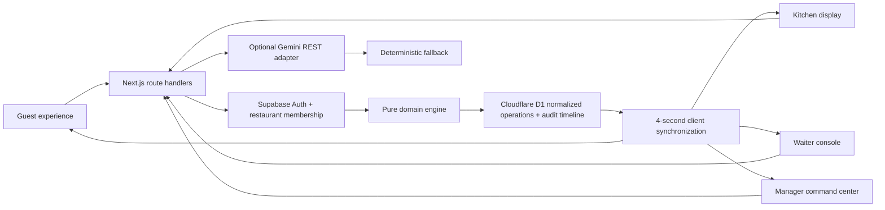

# FlowDine AI

> **Every table. Every ticket. In one flow.**

FlowDine AI is a live restaurant digital twin for the fictional flagship restaurant **Saffron Circuit**. It connects guest demand, recipe-aware menu availability, kitchen tickets, table service, inventory, queues, reservations, and manager intelligence in one shared operating state.

[**Open the live public demo →**](https://flowdine-ai.abhinavchaudhary484.chatgpt.site)


## Hackathon submission

| Required item | Submission detail |
|---|---|
| Team name | **FlowDine AI** |
| Hosted application | [flowdine-ai.abhinavchaudhary484.chatgpt.site](https://flowdine-ai.abhinavchaudhary484.chatgpt.site) |
| Public repository | [github.com/abhinav-codes123/Vibeathon](https://github.com/abhinav-codes123/Vibeathon) |
| Problem statement | VibeAthon 6.0 - Smart Restaurant Management System |

## Why it exists

Restaurants often run the dining room, kitchen, stock room, and guest journey in separate tools. That fragmentation creates unavailable-item orders, missed service requests, long waits, hidden bottlenecks, and reactive purchasing. FlowDine makes the restaurant observable and actionable as one system.

The central proof is an end-to-end order:

1. The menu calculates portions from the limiting recipe ingredient.
2. A guest builds a cart, then verifies their identity with Google or email at checkout.
3. The server links the order to that verified account, reserves ingredients, records inventory movements, and creates a received kitchen ticket.
4. Kitchen and waiter checkpoints update the customer's private tracker on every signed-in device.
5. Manager metrics, forecasts, risks, and the copilot update from the same state.

## Product surfaces

- **Guest:** public menu browsing and cart, verified Google/email checkout, cross-device order history, private live tracking, reservations, and queue.
- **Kitchen:** received, accepted, preparing, and ready checkpoints with ticket age, lateness, allergens, notes, workload, and role-owned transitions.
- **Waiter:** prioritized ready dishes and guest requests plus a live table map.
- **Manager:** opening/intake controls, kitchen and waiter visibility, kitchen/waiter invitations, reservations, menu availability, revenue rhythm, factual service summary, stockout watch, audit history, export, and an operations copilot.
- **Owner:** manager capabilities plus manager creation, safe first-owner setup, and full staff lifecycle control.
- **AI workflow:** optional Gemini 3.6 Flash advisory answers via REST. With no key, the same UI returns deterministic evidence-based recommendations.

## Architecture



See [docs/ARCHITECTURE.md](docs/ARCHITECTURE.md) and [docs/DATABASE.md](docs/DATABASE.md) for the detailed flow and schema rationale.

## Stack

- Next.js 16 App Router, React 19, strict TypeScript
- Vinext/Vite deployment adapter for Cloudflare
- Cloudflare D1 normalized operational tables with atomic version-token batches
- Drizzle schema/migrations for D1
- Supabase email/password and Google OAuth with cookie-backed SSR sessions
- PostgreSQL restaurant memberships for server-resolved staff authorization
- Supabase/PostgreSQL production migration with tenant IDs and initial RLS policies
- Gemini REST adapter with deterministic no-key fallback
- CSS design system with no component library dependency
- Node test runner, ESLint, and TypeScript compiler

## User stories completed

| Level | Story | Status | FlowDine evidence |
|---|---|---|---|
| Bronze | **1 - Modern customer and management UX** | Complete | Responsive guest, kitchen, waiter, manager, owner, login, and account experiences. |
| Silver | **2 - Verified email, Google OAuth, and role-based access** | Complete | Checkout offers Google and verified-email authentication, orders are account-owned across devices, and staff roles are resolved from server-side memberships. |
| Silver | **3 - Digital restaurant operations** | Complete | Digital menu, recipe-derived live availability, orders, reservations, queue, billing, notifications, and synchronized service workflows. |
| Gold | **4 - Restaurant management dashboard** | Complete | Orders, tables, inventory, sales rhythm, forecasts, operational risks, audit-backed actions, and analytics. |
| Platinum | **5 - Intelligent operations** | Complete | Explainable recommendations, inventory risk, demand forecasting, operational insights, and an evidence-grounded manager copilot. |

The ranking is cumulative. All five user stories are implemented, so the
submission demonstrates the **Platinum** feature set plus additional
recipe-aware availability, privacy projection, and digital-twin workflows.

## AI usage

- The manager copilot can call the Gemini REST API when `GEMINI_API_KEY` is
  configured.
- Only aggregated restaurant metrics are sent to Gemini; guest identities,
  phone numbers, and private order notes are excluded.
- Recipe availability, totals, forecasts, permissions, and other operational
  facts are calculated by deterministic application code. The model only
  explains evidence and suggests priorities.
- Without a Gemini key, the same interface uses a deterministic evidence-based
  fallback, so the demo remains functional and honest.

## Seeded demo

The seed models one busy evening at Saffron Circuit:

- 18 recipe-linked dishes across five categories
- 18 ingredients with par levels and costs
- 16 dining tables
- active kitchen tickets, reservations, a queue, service requests, revenue history, hourly demand, and feedback

All prices are stored in paise and displayed in INR. Images are loaded from Unsplash and therefore require an internet connection; core workflows do not.

## Run locally

Requirements: Node.js 22.13+ and pnpm.

```bash
pnpm install
pnpm dev:local
```

Open `http://localhost:3000`. `dev:local` uses an in-memory development adapter and resets to seed data when the server restarts.

Cloudflare-local development uses `pnpm dev`, but Workerd requires macOS 13.5+ on macOS. The production deployment does not share that local OS limitation.

## Configuration

Copy `.env.example` to `.env.local` only if you want optional integrations:

```bash
cp .env.example .env.local
```

| Variable | Required | Purpose |
|---|---:|---|
| `GEMINI_API_KEY` | No | Enables live Gemini advisory responses. Kept server-side. |
| `GEMINI_MODEL` | No | Defaults to `gemini-3.6-flash`. |
| `NEXT_PUBLIC_SITE_URL` | No | Absolute metadata URL for local/custom-domain builds. |
| `NEXT_PUBLIC_SUPABASE_URL` | Authentication | Supabase project URL. |
| `NEXT_PUBLIC_SUPABASE_PUBLISHABLE_KEY` | Authentication | Browser-safe Supabase publishable key. |
| `SUPABASE_SERVICE_ROLE_KEY` | Staff invitations | Server-only key used to send invitations and perform guarded first-owner setup. |
| `FLOWDINE_BOOTSTRAP_OWNER_EMAIL` | First setup | Verified email allowed to become the first owner when no owner exists. |
The public guest experience still works without an AI key. Verified staff access
requires a configured Supabase project. D1 is injected as the `DB` binding from
`.openai/hosting.json`.

## Database and migrations

Hosted demo:

```bash
pnpm db:generate
```

- `drizzle/0000_flowdine_state.sql` preserves the legacy snapshot for one-time migration.
- `drizzle/0001_normalized_operations.sql` creates separate restaurant, menu,
  recipe, inventory, order, timeline, table, queue, reservation, request, staff,
  movement, and audit tables.
- `drizzle/0002_customer_order_ownership.sql` links orders to the verified
  Supabase user ID and indexes cross-device customer history.
- First run imports an existing snapshot or seeds Saffron Circuit. Writes use one
  guarded D1 batch so related operational records change atomically.

Supabase authentication and production-schema migrations:

```bash
supabase link --project-ref YOUR_PROJECT_REF
supabase db push
```

`supabase/migrations/202607260001_flowdine.sql` contains the normalized multi-tenant model. It is a migration path, not the persistence layer used by the hosted hackathon build. Complete organization-specific auth policies and integration tests before treating that path as production-ready.

`supabase/migrations/202607270001_flowdine_auth.sql` adds profile provisioning,
membership read policies, and the seeded restaurant. See
[docs/AUTHENTICATION.md](docs/AUTHENTICATION.md) for provider,
redirect, role assignment, and deployment setup.

`supabase/migrations/202607300001_single_restaurant_staff.sql` adds owner-managed
staff invitations. An invited email receives its assigned role only after that
same email completes Supabase verification.

`supabase/migrations/202607300002_staff_invite_lifecycle.sql` adds real invitation
delivery support, pending/accepted status, owner-only manager creation,
manager-scoped kitchen/waiter administration, verified acceptance, and guarded
first-owner bootstrap.

## Quality commands

```bash
pnpm typecheck
pnpm lint
pnpm test
pnpm build
pnpm verify:production-auth
```

The domain suite covers recipe availability, stock reservation/restoration, preparation estimates, queue estimates, paise-safe bill splitting, safe recommendations, forecasting, and role permissions.
`verify:production-auth` checks the live providers, anonymous isolation,
authenticated checkout boundary, private order APIs, protected dashboards,
protected staff APIs, and the manager copilot boundary.

## Demo access

- Menu browsing, cart building, reservations, and queue entry remain public.
- Placing an order requires Google or verified-email authentication. The order
  then appears under `/orders` on every device using that account.
- Kitchen, waiter, manager, and owner workspaces require a verified Supabase
  session and a matching `restaurant_memberships` row.
- Email/password registration requires confirmation; Google OAuth returns through
  the server callback.
- Owners invite managers; owners and managers invite kitchen/waiter staff.
  Every role is resolved from the protected membership table and never from a
  browser-controlled claim.
- Default sign-in routes kitchen staff to `/kitchen`, waiters to `/staff`,
  managers and owners to `/dashboard`, and customers to `/menu`.

The browser no longer supplies an authoritative role. Staff state reads,
mutations, direct routes, and the manager copilot resolve the role from the
verified membership on the server.

## Five-minute walkthrough

1. Open the landing page and explain the live digital twin.
2. Enter **Guest**, add a limited-stock dish, and choose Google or email at checkout.
3. Place the restored cart and open the private live order tracker.
4. Switch to **Kitchen** and demonstrate receive → accept → prepare → ready while the tracker updates.
5. Open the same customer account on another device and show the synchronized order.
6. Open **Manager**, send a kitchen/waiter invitation, and explain the operational metrics.
7. Open **Owner** to show owner-only manager creation.

For a judge-ready script, see [docs/DEMO_SCRIPT.md](docs/DEMO_SCRIPT.md).

## Security and privacy

- Mutations are validated server-side against a role/action permission matrix.
- Staff identity is verified from Supabase cookies and authorization comes from
  the PostgreSQL membership row, never a browser role header.
- Public state responses exclude customer orders and redact operational,
  revenue, inventory, guest-name, reservation-phone, and audit data.
- Private order APIs filter by the server-verified Supabase user ID; another
  customer receives no order details.
- Inventory cannot go negative; invalid transitions and stale concurrent writes are rejected.
- Gemini receives only aggregated operational context, not phone numbers or guest identities.
- Secrets remain server-side and `.env*` is ignored except `.env.example`.
- Security headers disable MIME sniffing, unnecessary device permissions, and cross-origin referrer leakage.
- D1 audit events record the actor, role, action, affected entity, summary, and timestamp.

**Important boundary:** authentication and the single-restaurant operational
database are real, but this branch is intentionally optimized for Saffron
Circuit. It is not a multi-restaurant SaaS and payments remain manually
recorded.

## Scalability path

The normalized D1 model is appropriate for this controlled single-location
pilot. At higher write volume or for multiple locations, move operations to the
normalized PostgreSQL schema, lock inventory rows transactionally, stream
domain events, use realtime delivery, cache menu reads, and partition analytics
from operational writes.

## Known limitations

- Staff invitations use Supabase email delivery. Production deliverability
  still depends on the configured Supabase SMTP provider and rate limits.
- Payments, customer notifications, receipts, and exports are simulated/in-browser.
- Restaurant workspaces poll every four seconds and customer trackers every
  three seconds rather than using WebSockets.
- The seed has 18 polished dishes rather than a full 25–35 item catalogue.
- Gemini was implemented as an optional server adapter; no live model call occurs without a user-supplied key.
- Supabase is the live identity/membership authority, while Saffron Circuit
  operational records use normalized D1 tables.

## Roadmap

- Inventory batch expiry, receiving, and waste capture
- Realtime events and offline-resilient kitchen/waiter clients
- Payment and notification providers
- Multi-location owner analytics and menu rollouts
- Forecast backtesting, confidence calibration, and human feedback loops

## Delivery references

- [Feature checklist](docs/FEATURE_CHECKLIST.md)
- [Architecture](docs/ARCHITECTURE.md)
- [Database design](docs/DATABASE.md)
- [Demo script](docs/DEMO_SCRIPT.md)
- [Judging criteria](docs/JUDGING_CRITERIA.md)
- [Implementation plan](docs/IMPLEMENTATION_PLAN.md)
- [Public deployment](https://flowdine-ai.abhinavchaudhary484.chatgpt.site)
- [Public GitHub repository](https://github.com/abhinav-codes123/Vibeathon)

## Team

**Team name:** FlowDine AI

FlowDine AI was built as a complete hackathon vertical slice: product design,
full-stack implementation, authentication and authorization, data modeling,
testing, security review, documentation, and deployment.
