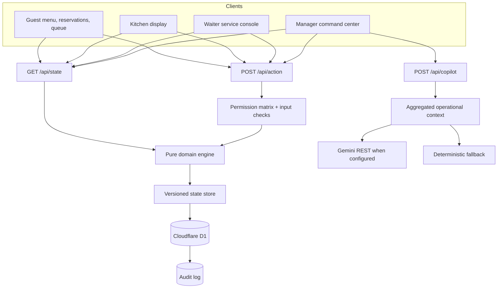
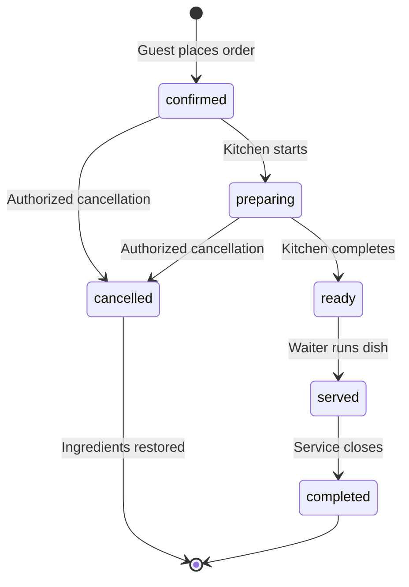
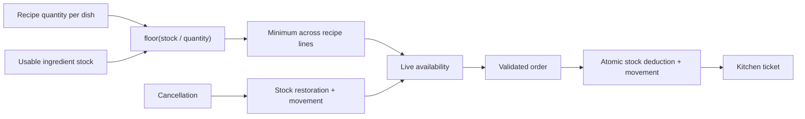

# Architecture

## System view

The operational UI reads one authoritative restaurant state every four seconds. Mutations never edit client state optimistically; the server validates, writes, and the client reloads the confirmed result.

## Order lifecycle

Every transition checks the current status. Replaying a stale transition is rejected, which protects duplicate taps and concurrent clients.

## Inventory flow

The menu does not use a hand-maintained availability flag. Manual pausing is supported, but stock availability is always recipe-derived.

## Role model

| Capability | Guest | Kitchen | Waiter | Manager/owner |
|---|---:|---:|---:|---:|
| Place order, reserve, join queue, request service | ✓ |  |  | ✓ |
| Advance kitchen stages |  | ✓ | Limited | ✓ |
| Resolve service requests and tables |  |  | ✓ | ✓ |
| Restock, pause items, export, manage all operations |  |  |  | ✓ |

The deployed judge demo selects these roles in the UI and sends `x-demo-role`. The server still applies the matrix, but the header is not a trusted identity claim. Production identity belongs in Supabase Auth plus restaurant memberships and RLS.

## Concurrency

D1 stores a version integer alongside the state document. Each mutation reads the current version and updates only when that version still matches. A collision retries up to three times, then returns a safe retry message.

## AI boundary

Deterministic availability, billing, forecasts, permissions, and risk cards are authoritative. Gemini is advisory. It receives only aggregated observed metrics and is instructed not to invent restaurant facts. Failures or missing credentials fall back to local evidence-backed guidance.
